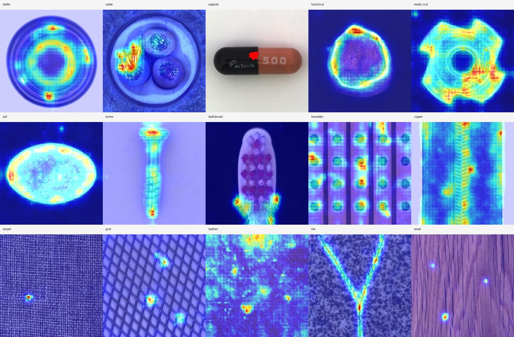
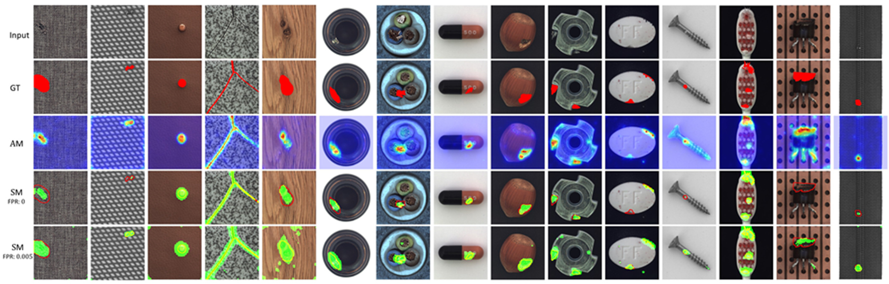

# DFR：MVTec AD 全 15 类复现

本仓库是在 [YoungGod/DFR](https://github.com/YoungGod/DFR) 基础上完成的
DFR（Deep Feature Reconstruction）复现工程。上游代码导入自提交
`f2e2d4ef5e542fb99aa41566cd9f662bec9ce771`，本仓库增加了现代
PyTorch 兼容、统一命令行入口、数据校验、断点续训、完整指标评估、报告生成和
15 类自动运行脚本。

## 复现状态

**已经完成 MVTec AD 全部 15 类、每类 700 epochs 的训练和测试。**

| 指标 | 15 类平均值 |
|---|---:|
| 图像级 AP | 0.96905 |
| 图像级 ROC-AUC | 0.93585 |
| 像素级 AP | 0.46119 |
| 像素级 ROC-AUC | 0.94746 |
| PRO-AUC | 0.89045 |
| Best IoU | 0.32075 |

论文主要报告像素级 ROC-AUC 和 PRO-AUC。本次复现的 15 类平均像素级
ROC-AUC 比论文表中 12 层配置高约 `0.01012`，平均 PRO-AUC 低约
`0.01222`。逐类别结果和与论文的差异均如实保留，没有通过未披露调参修改结果。

完整数值请查看：

- [逐类别 Markdown 报告](reports/dfr_mvtec_summary.md)
- [机器可读 CSV 指标](reports/dfr_mvtec_summary.csv)
- [运行环境记录](reports/environment.json)
- [MVTec AD 数据校验记录](reports/mvtec_validation.json)

## 结果放在哪里

GitHub 上已经提交的是可复现代码、紧凑指标报告和精选异常图：

| 内容 | 仓库位置 |
|---|---|
| 15 类汇总指标 | `reports/dfr_mvtec_summary.md`、`reports/dfr_mvtec_summary.csv` |
| 15 类精选异常图 | `docs/assets/visual_examples/` |
| 代码阅读指南 | `docs/dfr_code_walkthrough.md` |
| 数据和环境校验 | `reports/mvtec_validation.json`、`reports/environment.json` |

下面是每个类别各选一张组成的结果总览：



服务器上的完整结果保留在 `/root/DFR/outputs/`，由于权重和全量图片体积较大，
没有提交到 Git：

| 本地内容 | 本地位置 |
|---|---|
| 每类 CAE 权重与 PCA 维度 | `outputs/models/<类别>/.../model/` |
| 损失曲线和逐阈值指标 | `outputs/models/<类别>/.../eval/` |
| 异常分数图、预测图、二值图和 mask | `outputs/Results/<类别>/.../` |
| 全量运行日志 | `outputs/logs/`、`outputs/full-reproduction.log` |
| MVTec AD 数据集 | `/root/DFR/data/mvtec_ad` |

例如 bottle 的最终 CAE 参数位于：

```text
outputs/models/bottle/AnoSegDFR(BN)_vgg19_l12_d197_s4_k4_nearest/model/autoencoder.pth
```

`data/`、`outputs/`、预训练权重、缓存和虚拟环境由 `.gitignore` 排除。
这是有意的：GitHub 保存代码与紧凑报告，服务器保存可重新生成的大型实验产物。

## 复现配置

本次实验保持论文核心配置：

- 输入图像：256 × 256
- 特征提取器：预训练 VGG19 前 12 个卷积层（冻结，不参与训练）
- 区域特征：4 × 4 聚合核，步幅 4，最近邻特征对齐
- 特征降维：PCA 保留 90% 方差，每个类别独立确定维度
- 训练对象：每个类别一个独立 CAE
- 优化器：Adam，学习率 `1e-4`
- batch size：4
- 训练轮数：每类 700 epochs
- 训练数据：只使用各类别的 `train/good` 正常图像
- 测试标签和像素 mask：只用于测试阶段计算 AUC、AP、PRO 和 IoU

整体流程为：

```text
图像 -> VGG19 多层特征 -> 4×4 区域聚合 -> CAE 特征重建
     -> 重建误差异常分数 -> 图像级/像素级评估
```

更详细的代码入口、张量流和关键函数见
[DFR 代码阅读指南](docs/dfr_code_walkthrough.md)。

## 环境

已验证环境：

```text
Conda 环境：dfr
Python：3.12.11
PyTorch：2.13.0+cu132
torchvision：0.28.0+cu132
CUDA：13.2
GPU：NVIDIA GeForce RTX 4090
```

复用服务器已有的 CUDA PyTorch 环境并安装其余依赖：

```bash
conda create -n dfr --clone py312 -y
conda run -n dfr python -m pip install -i https://pypi.org/simple -r requirements.txt
```

本项目的安装、校验、测试和训练命令均在 `dfr` Conda 环境中运行；项目内已有
`.venv` 不使用，也不与 `py312` 混用。

## 数据集

从 [MVTec AD 官方页面](https://www.mvtec.com/research-teaching/datasets/mvtec-ad)
下载数据，并将 15 个类别目录放到 `data/mvtec_ad`。如果官方下载页面不可用，
可使用项目提供的研究用途下载脚本：

```bash
conda run -n dfr python scripts/download_mvtec.py \
  --output data/mvtec_ad \
  --workers 32
```

运行前校验类别、图片数量和 mask 对应关系：

```bash
conda run -n dfr python scripts/validate_mvtec.py data/mvtec_ad \
  --json reports/mvtec_validation.json
```

本次数据校验结果为 15 个类别、5,354 张图像和 1,258 张异常 mask。
MVTec AD 数据不随本仓库分发，仅用于遵守
[CC BY-NC-SA 4.0](https://creativecommons.org/licenses/by-nc-sa/4.0/)
的非商业研究。

## 运行方法

先进行全 15 类 1 epoch 冒烟测试：

```bash
conda run -n dfr python DFR-source/main.py \
  --mode all \
  --data-root data/mvtec_ad \
  --categories all \
  --epochs 1 \
  --checkpoint-every 1 \
  --metric-steps 100 \
  --no-save-visualizations \
  --resume
```

按论文配置运行 700 epochs：

```bash
conda run -n dfr python DFR-source/main.py \
  --mode all \
  --data-root data/mvtec_ad \
  --categories all \
  --epochs 700 \
  --checkpoint-every 10 \
  --metric-steps 5000 \
  --resume
```

服务器长时间运行可使用按类别串行、支持断点恢复的脚本：

```bash
mkdir -p outputs
nohup conda run --no-capture-output -n dfr python \
  scripts/run_full_reproduction.py \
  > outputs/full-reproduction.log 2>&1 &
```

再次执行同一命令会从未完成类别的 checkpoint 恢复。若不希望脚本自动提交紧凑
报告，可增加 `--no-push`。

## 测试

```bash
conda run -n dfr python -m unittest discover -s tests
```

当前测试结果：8/8 通过。

## 分支和版本

- `main`：已完成的复现版本
- `reproduction`：复现过程分支，与当前 `main` 同步
- `dfr-reproduction-v1`：全 15 类 700 epochs 完成时创建的版本标签

## 上游代码与许可说明

原始论文代码来自 [YoungGod/DFR](https://github.com/YoungGod/DFR)。上游仓库
没有提供软件 LICENSE，因此上游源码和图片的权利仍归原作者所有；本仓库不声称
能够对其重新许可。本仓库中的兼容与复现修改也不改变这一事实。

论文：

- Yong Shi, Jie Yang, Zhiquan Qi. *Unsupervised anomaly segmentation via
  deep feature reconstruction*. Neurocomputing, 2021.
  [论文页面](https://www.sciencedirect.com/science/article/pii/S0925231220317951) ·
  [arXiv](https://arxiv.org/abs/2012.07122)

上游仓库给出的定性结果：



## 引用

```bibtex
@article{DFR2020,
  title = {Unsupervised anomaly segmentation via deep feature reconstruction},
  journal = {Neurocomputing},
  year = {2020},
  issn = {0925-2312},
  doi = {https://doi.org/10.1016/j.neucom.2020.11.018},
  url = {http://www.sciencedirect.com/science/article/pii/S0925231220317951},
  author = {Yong Shi and Jie Yang and Zhiquan Qi}
}

@misc{yang2020dfr,
  title = {DFR: Deep Feature Reconstruction for Unsupervised Anomaly Segmentation},
  author = {Jie Yang and Yong Shi and Zhiquan Qi},
  year = {2020},
  eprint = {2012.07122},
  archivePrefix = {arXiv},
  primaryClass = {cs.CV}
}
```
