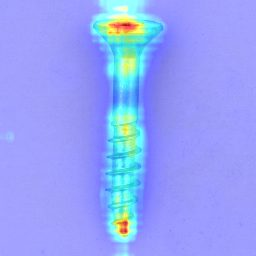
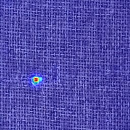
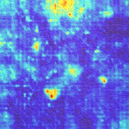
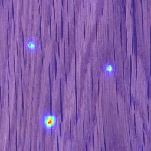

# Selected DFR visual examples

This folder contains a compact qualitative sample from the completed 15-category
MVTec AD reproduction. Each image is a compressed copy of one generated
`gt_pred_score_map` anomaly visualization from the local `outputs/Results`
directory.

The full generated `outputs/` tree is intentionally not tracked because it
contains checkpoints, logs, dense maps, and thousands of images. These examples
are included only for quick non-commercial research inspection under the MVTec
AD dataset terms.

## Contact sheet

## Individual examples

| Category | Example |
|---|---|
| bottle |  |
| cable |  |
| capsule |  |
| hazelnut |  |
| metal_nut |  |
| pill |  |
| screw |  |
| toothbrush |  |
| transistor |  |
| zipper |  |
| carpet |  |
| grid |  |
| leather |  |
| tile |  |
| wood |  |

`selected_sources.tsv` records the local generated source file used for each
compressed example.
